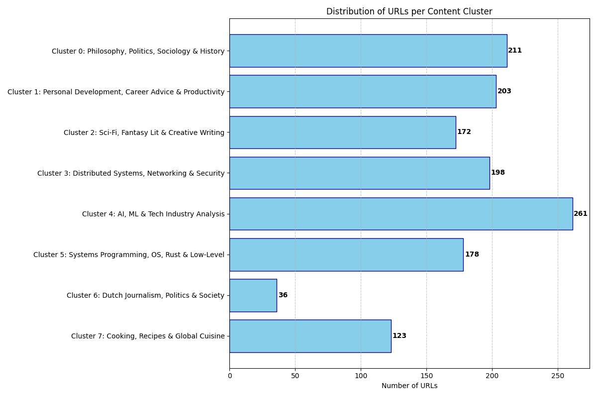

# An investigation into my addiction

I'm addicted to reading little articles from all over the internet.
This investigation was done for a PowerPoint Party with friends on November 23th, 2025.
See the [slides](./Mijn%20verslaving.pdf).

I've processed my Pocket export, crawled the web pages for content, and used semantic embeddings to cluster the different articles.
All embeddings were generated using Qwen3-Embedding-8B (had to chunk up articles to fit them in the context window; then calculated the full document embedding with mean pooling of all the chunks' embeddings).



## How to run

Build the main Rust program:
```sh
cargo build --release
```

Then interact with it using the CLI:
```
>>> ./target/release/reading-addiction --help
Interact with the reading addiction project

Usage: reading-addiction [DB] [COMMAND]

Commands:
  pocket     parses a Pocket CSV export
  crawl      starts crawl for all items that don't have html yet
  histogram  get latest crawl results as a histogram
  embed      embed articles
  cluster    get URLs and their doc embedding vector
  help       Print this message or the help of the given subcommand(s)

Arguments:
  [DB]  Path to the database [default: addiction.db]  
```

All of the Python scripts have [inline script metadata](https://packaging.python.org/en/latest/specifications/inline-script-metadata/) so they can be run with a single command:
```sh
uv run <script>
```

The method for data ingestion differs between them.

```sh
./target/release/reading-addiction histogram | uv run ./scripts/http-histogram.py
```

```sh
uv run ./scripts/reading_time.py addiction.db
```

```sh
uv run ./scripts/tag_hist.py addiction.db
```

```sh
./target/release/reading-addiction cluster| uv run ./scripts/cluster_3d.py
```
